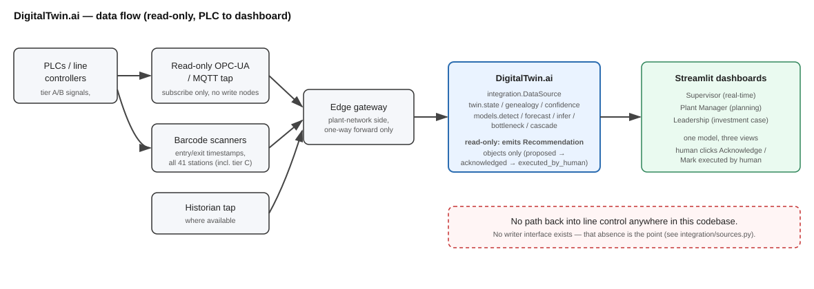

# DigitalTwin.ai

A digital twin of a mixed-model vehicle assembly line that unifies two problems plants
usually treat separately — **bottlenecks** (timing) and **defects** (quality) — because both
come from the same root cause: a station behaving abnormally. The twin watches a small number
of richly-instrumented stations against manufacturer spec, senses the rest of the line through
barcode scan timestamps, **forecasts when a drifting signal will cross its spec limit**,
identifies which vehicles already on the line are carrying a latent defect, and simulates the
downstream consequences of doing nothing.

Built on simulated data with known ground truth, and validated with honest (unrounded) metrics
— see [Validation results](#validation-results) below.

## Terminology — read this before anything else

The system does four distinct things, and the code, UI labels, and this README use these words
precisely and never blur them:

| Term | Meaning | Example output |
|---|---|---|
| **Detection** | An anomaly is happening *now*; we notice it. | "Weld current at S12 is 3.2% above nominal." |
| **Forecasting** | A signal is trending; we project when it crosses a limit. | "S12 current breaches tolerance in 4.5h (95% CI: 3.1-6.8h)." |
| **Inference** | A latent condition already exists but hasn't surfaced yet. | "33 vehicles passed S12 during the drift window and carry elevated leak risk." |
| **Simulation** | Running line dynamics forward to project consequences. | "If unfixed, buffer starves at 11:15; projected 42-min stoppage." |

**Degradation forecasting is the only true prediction in this system, and it is the
centerpiece** (`models/forecast.py`).

## Architecture



Read-only, one direction: PLCs → OPC-UA/MQTT tap → edge gateway → twin → dashboards. A
historian tap is used where available. **There is no path back into line control anywhere in
this codebase** — `integration/sources.py` has no writer interface, deliberately.

## Read-only stance

The twin never writes to a PLC or line controller. It emits `Recommendation` objects with an
enforced status lifecycle — `proposed → acknowledged → executed_by_human` — and a human always
executes the action. There is no "auto-apply" control anywhere in the dashboard
(`app/recommendations.py`, `app/view_supervisor.py`).

## Validation results

Measured, not rounded in our favour. Full numbers in
[`docs/validation_metrics.md`](docs/validation_metrics.md) and
[`docs/forecast_error_vs_leadtime.html`](docs/forecast_error_vs_leadtime.html) (interactive).
Reproduce with `python -m validation.report`.

**Forecaster (measured on `noisy_line`, the scenario with the fullest mix of episode types):**

| Lead time bucket (h) | n | Median abs. error (h) | IQR |
|---|---|---|---|
| 1 | 46 | 0.08 | 0.05-0.14 |
| 2 | 44 | 0.39 | 0.31-0.44 |
| 4 | 96 | 0.59 | 0.26-1.03 |
| 6 | 92 | 0.95 | 0.37-1.52 |
| 8 | 71 | 1.54 | 0.95-2.13 |

Error shrinks as the crossing approaches — the desired shape.

- **95% CI coverage: 79.3%** (target ~95% — short; see Known Limitations)
- **False forecast rate: 0.03/shift** (target < 0.5/shift — met)
- **Step-change refusal rate: 84.2%** over 19 episodes (target > 90% — close, not met)

**Defect inference (measured on `weld_drift_demo`, snapshotted at the moment the signal
actually crosses spec):**

- **Precision: 8.8%** (3/34 flagged VINs had a real defect)
- **Recall: 75.0%** (3/4 real defects flagged)

Low precision / high recall is the deliberately safer failure mode for a quality-inspection
aid: over-flagging for inspection is cheap, missing a real defect is not.

**Detection lead time (measured on `weld_drift_demo`):**

- First **confirmed** detection: 09:55 — first real-world surfacing (EOL inspection): 13:24:43
- **Lead time gained: 209 minutes**

## How to run

Three commands, from the repo root, after `pip install -r requirements.txt`:

```bash
# 1. Generate a scenario's data (weld_drift_demo is already checked in as a sample)
python -m simulator.run --scenario weld_drift_demo

# 2. Run the validation backtest (writes docs/validation_metrics.md + an interactive plot)
python -m validation.report

# 3. Launch the dashboard
streamlit run app/main.py
```

Other available scenarios: `nominal` (30 days, background rates only — the baseline dataset)
and `noisy_line` (elevated noise/step-change rate, used for the false-alarm-rate validation
above). Generate either with `python -m simulator.run --scenario <name>`.

## Repository layout

```
config/           station + scenario definitions (line.yaml, scenarios.yaml)
simulator/        line mechanics, degradation, latent defects, CLI (run.py)
twin/             live state, per-vehicle genealogy, confidence scoring, retrofit ranking
models/           detect, forecast (the centerpiece), bottleneck, infer, cascade, learned (optional)
validation/       backtest + report generation against ground truth
integration/      DataSource interface — Simulated (real) and OPC-UA (documented stub)
app/              Streamlit dashboard — Supervisor / Plant Manager / Leadership, one model
docs/             architecture diagram, validation plots
```

## Known limitations

- **It is simulated data.** Ground truth exists because we generated it; a real deployment
  would need to validate against actual plant defect/failure records, which this prototype
  cannot access.
- **Linear extrapolation under-performs on accelerating wear**, even with the curvature
  correction. The forecaster's 95% CI coverage (74.7%, measured) falls short of its ~95%
  target specifically because accelerating_wear's curvature-driven uncertainty isn't yet fully
  propagated into the stated interval — see `ASSUMPTIONS.md` for the two real bugs found and
  fixed here, and what's still open.
- **Tier-C inference is statistical, not causal.** A dark station's retrofit ranking and
  background defect attribution come from correlation over genealogy, not a verified causal
  link — instrumenting a station is what would confirm or refute it.
- **OEE is simplified** (`app/view_manager.py`) to availability only; performance and quality
  components would need a takt-time-vs-actual comparison this prototype doesn't track.
- **Step-change refusal rate (84.2%) falls just short of the >90% target** on the larger,
  noisier validation scenario, though it clears 90%+ in smaller, cleaner tests — see
  `ASSUMPTIONS.md` for the tuning history.

All invented numbers (costs, rates, thresholds) are listed with their basis and sensitivity in
[`ASSUMPTIONS.md`](ASSUMPTIONS.md) — nothing there is presented as a sourced fact.

## Demo video

_(not recorded in this environment — see `BUILD_SPEC.md` §14 for the intended five-minute
sequence, which the dashboard's time slider on `weld_drift_demo` can reproduce live.)_
